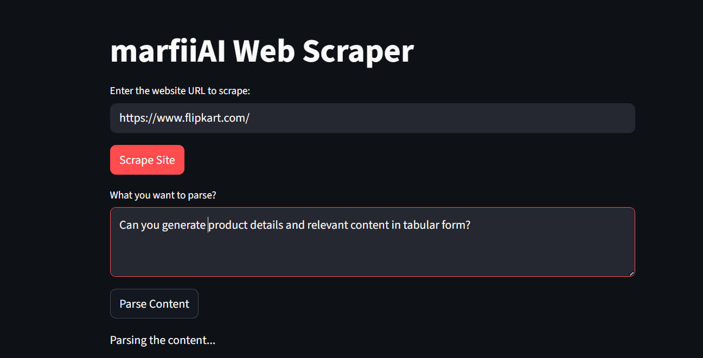

# 🧠 MarfiiAI Web Scraper

MarfiiAI Web Scraper is an AI-powered website scraping and analysis tool that uses **Selenium** to extract website content and **Ollama with LLaMA 3.1** to understand, summarize, and answer questions about the scraped data.
Instead of just scraping data, MarfiiAI acts like a chatbot for any website — allowing users to interact with web content in natural language.

-----

## 🖼️ Tool Preview:

<p align="center">
  
</p>
<p align="center">
  
</p>

## 🛠 Tech Stack Used:

| Component | Technology |
|----------|-----------|
| Web Scraping | Selenium |
| AI Engine | Ollama |
| Model | LLaMA 3.1 |
| Language | Python |
| Automation | ChromeDriver |
| User Interface | Streamlit |
-----

## 🚀 Features:

- ✅ Scrape dynamic websites using Selenium  
- ✅ Process content with LLaMA 3.1 using Ollama  
- ✅ Ask questions about website content  
- ✅ Summarize and format pages for readability  
- ✅ Local processing (no cloud APIs required)  
- ✅ Lightweight and scalable design  
- ✅ Extensible architecture

-----
## ⚙️ Installation & Run:

1. Clone this repository:

   ```bash
   git clone https://github.com/your-username/marfiiAI-web-scraper-tool.git
   ```
2. Navigate into the project folder:

   ```bash
   cd marfiiAI-web-scraper-tool
   ```
3. Install dependencies:

   ```bash
   pip install -r requirements.txt
   ```
4. Run the project:

   ```bash
   streamlit run main.py
   ```
   -----
## 🤝 Developer

* **Maroof Gadiwale** – IT Student | Aspiring Data Scientist | ML Engineer ❤️

---
<center>✨ Feel free to use this tool for scraping websites ✨</center>  
